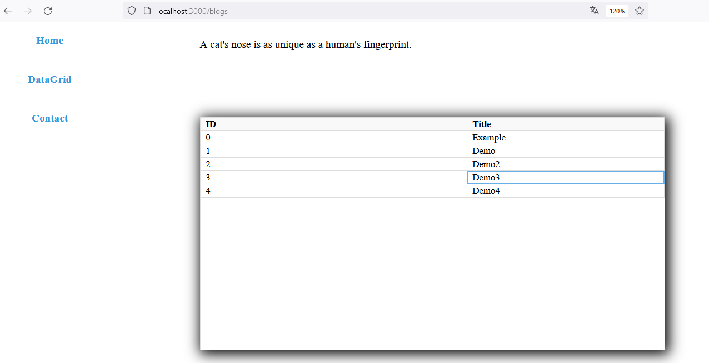
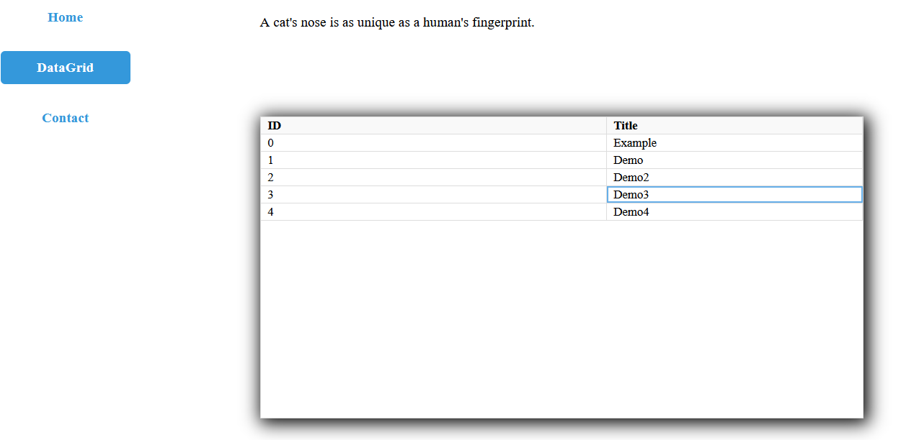

# Routing in React

I finally reserved some time to mess around with routing in react.
Other thing that I tried is creating, using and fully understanding
tables (data grid). I used `react-data-grid` component, and it's fairy simple
but I need to find a couples more and test them. 

# Screens
</src>
</src>